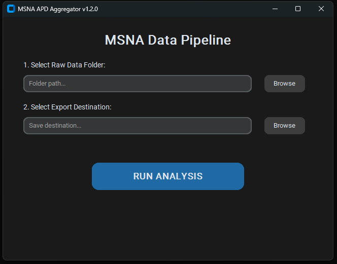
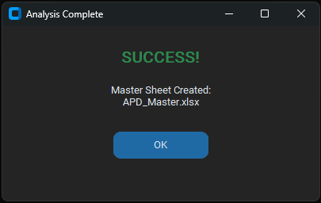

# MSNA APD Aggregator (v1.2.0)

## Overview
This tool automates the aggregation of multi-sheet Excel exports from Microneurography (MSNA) action potential analysis. Example data (randomized with realistic values) are provided. 

## Key Features
- **GUI Interface:** Simple folder selection for non-technical users.

- Upon successful execution, the toolkit provides a custom-themed notification confirming the file creation and log generation.

- **Statistical QA:** Automatic Z-score flagging (1σ, 2σ, 3σ) of physiological outliers.
- **Audit Logging:** Generates a timestamped log of all processed files for reproducibility.

## Installation
1. Clone the repository: `git clone https://github.com/Jonathan-Hoch/msna-apd-aggregator.git`
2. Install dependencies: `pip install -r requirements.txt`
3. Run the app: `python msna_aggregate.py`

## Technical Architecture
Built with Python using `Pandas` for data transformation and `OpenPyXL` for conditional formatting.
